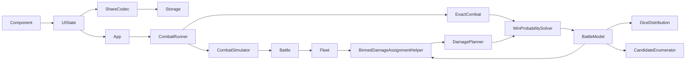

# Architecture

Luminary has a browser application layer and two battle execution paths that share ship and
damage-assignment rules:

- The application layer owns editable setup state, persistence, presentation, and interactive
  strategy selection.
- The simulation path samples dice and mutates live `Fleet` and `Ship` objects.
- The exact path enumerates dice outcomes and evaluates a graph of immutable HP states.

`Battle` is authoritative for user-visible combat semantics. When its schedule, terminal rules,
healing, or damage order changes, update the corresponding pure model behavior and contract
tests in the same change.



Dependencies point inward: browser components may use UI-domain rules and engine types, while
engine modules do not import UI state, DOM APIs, storage, or presentation code. `app.ts` is the
composition root between those layers.

## Engine Module Ownership

- `battle.ts`: authoritative mutable battle loop, phase order, healing boundaries, and terminal
  outcomes.
- `battle-rules.ts`: pure survival-to-terminal mapping shared by mutable and exact engines.
- `combat-result.ts`: the shared, engine-level outcome summary returned by exact and sampled
  execution. Interactive-only method and fallback metadata belongs to `combat-runner.ts`.
- `fleet.ts` and `ship.ts`: mutable combat entities, weapon rolls, planner lifetime, and battle
  reset behavior.
- `binned-damage-assignment-helper.ts`: routes NPC, DPS, initiative, and optimal assignments.
- `candidate-enumerator.ts`: legal distinct damage-assignment successors.
- `dice-distribution.ts`: exact probability distribution for a schedule slot.
- `battle-state.ts`: immutable exact-model schedule and one-slot state transitions. It does not
  solve graph values.
- `win-probability-solver.ts`: graph construction, minimax value iteration, and forward outcome
  propagation. It does not reproduce battle transitions.
- `optimal-damage-planner.ts`: adapts solved state values to the mutable planner interface and
  owns matchup-level solver caching.
- `exact-combat.ts`: converts one or more fleets into exact solves and maps their outcomes to the
  shared engine result shape. Multi-fleet combat composes adjacent two-fleet exact engagements in
  the same order as `MultiBattle`, carrying terminal HP into the next engagement. A request-local
  engagement cache excludes fleet names while retaining roles, policy, configuration, HP, and
  resolved phase order; the multi-fleet reporting layer applies fleet identity and attribution to
  cached terminal HP.
- `combat-runner.ts`: owns the interactive `exact-optimal` → `exact-dps` → `monte-carlo-dps`
  strategy ladder, its single request-wide deadline, planner-safe fleet cloning, and serializable
  fallback diagnostics.

## Application and UI Ownership

- `app.ts`: application startup, routing, render scheduling, persistence wiring, and the boundary
  between editable UI state and engine fleets. It disposes prior bindings when reinitialized and
  maps engine identities/results to presentation. Combat policy belongs in the engine runner
  rather than being reproduced here.
- `ui/state.ts`: the only mutable browser setup store. Its atomic commands apply setup changes and
  notify subscribers; subscriptions return a disposer. Components should not reproduce
  fleet-validity rules before calling it.
- `ui/ship-config.ts`: pure normalization, deep cloning, and behavior-based equality for optional
  ship configurations.
- `ui/fleet-rules.ts`: pure defender/attacker legality, player/NPC compatibility, and first-valid
  composition sanitization. State commands, controls, and share-link decoding use the same rules.
- `ui/ship-presets.ts` and `ui/fleet-metadata.ts`: canonical preset, quantity, faction, label, color,
  and unique derived fleet-name data. They do not own browser state.
- `ui/share.ts`: the versioned query codec plus share/report formatting. Decoding is lenient about
  unknown input but delegates fleet legality and config comparison to the UI-domain helpers.
- `ui/storage.ts` and `ui/preferences.ts`: fail-soft browser persistence adapters. Stored battle
  setups use the share query as their single serialized format.
- `ui/components/*`: custom-element rendering and interaction. Each component keeps its template,
  styles, and focused tests together and delegates durable mutations to `ui/state.ts`.

### Setup State Contract

Fleet position determines role: index 0 is the defender and later entries are attackers. NPCs,
starbases, and orbitals are defender-only; player hulls may mix, while an NPC fleet contains one
NPC type. A fleet has at most one row and one configuration for each ship type. Input order matters
when sanitizing imported data: after role-invalid entries are removed, the first valid ship
determines player versus NPC composition, and the first row for each type is retained. State takes
ownership of imported and updated configurations and clamps quantities at this boundary.

These rules apply at the state boundary, not only in visible controls. The URL decoder applies the
same pure sanitization so shared links, restored setups, and direct state commands cannot drift.
Share decoding must remain backward-compatible for supported versions; storage is not a second
battle format. Preset add, swap, and repeat-increment behavior goes through the atomic
`addOrSwapShipPreset` state command so configuration caching and notifications occur once.

Engine result maps use `FleetState.id` as identity even though the engine field is historically
named `Fleet.name`. Visible faction/role names are derived presentation and must not be used as
keys; duplicate faction labels remain safe and can change without invalidating a result.

Survivor-distribution entries may also carry engagement-boundary destruction credit for reputation
draws. Presence of a fleet key means that fleet entered an engagement, including when its credited
composition is empty; an absent key means it never fought in that terminal outcome. Each participant
receives the enemy hulls lost during its engagement, and no per-shot history is retained. Sampled
combat records the before/after living composition around each `Battle`. Exact multi-fleet combat
carries credit and retreat variants as reporting payload on a merged HP branch, so result detail
does not become part of the combat-state key or cause an otherwise identical engagement to be
solved again.

Terminal survivor entries distinguish control from survival. `lastFleetStanding` names the fleet
that retained the sector (or is `null` for a final draw), while `survivors` contains every living
hull, including fleets removed from battle by a defender-favored stalemate. Material loss uses all
survivors; population bombardment uses only the last fleet standing. Exact multi-fleet branches
archive living removed fleets in the same reporting payload described above, without adding them
back to later engagements.

### Control Reuse Boundaries

Reuse presentation and behavior separately. The damage-planner and recent-battles controls are
standard compact select surfaces and may share sizing, typography, border, and focus rules even
though their option sources and change handlers remain local.

NPC preset pickers are intentionally different. They are command controls styled as quick-access
pills: choosing a value adds a ship, increments an identical preset, or swaps an existing NPC
variant, then clears the selection. Do not force them through a generic value-select component or
make them look stateful. The general add-ship selector is also a command control, but it has its
own availability and cached-configuration behavior. Shared primitives are appropriate only where
those interaction contracts actually match.

## Solver Contract

Construct the solver with named options:

```ts
new WinProbabilitySolver(model, {
  perspective: 'A',
  assignments: 'minimax',
});
```

`perspective` controls whose win probability `solve()` reports. It does not control who gets
decision nodes.

`assignments` controls the policy model:

- `policy`: player fleets use deterministic DPS assignments and NPC fleets use NPC assignments.
- `minimax`: selected non-NPC assignments are decisions. By default both player fleets are
  selected; exact combat and the mutable optimal planner pass only the roles whose fleet damage
  type is `OPTIMAL`. Attacker nodes maximize and defender nodes minimize the queried reach
  objective.

The UI's `DamageType.OPTIMAL` selects minimax assignments. If an interactive solve exceeds its
caps, `OptimalDamagePlanner` falls back to DPS.

For diagnostics, `getGraphStats()` reports chance and decision ownership counts, while
`explainDecision(stateKey)` reports each dice outcome's candidate values and selected option.
These methods solve lazily and return read-only data; they do not alter the policy.

## Outcome Semantics

Terminal outcomes are `AttackerWins`, `DefenderWins`, and `Draw`. A draw is not a win for either
fleet. Non-terminating probability mass is credited to the defender, matching the mutable
engine's round-cap behavior.

For attacker perspective, the solver evaluates reachability of `AttackerWins`. For defender
perspective, it evaluates the complement of reaching `AttackerWins` or `Draw`; this preserves
both draw-as-loss and defender-favored nontermination.

## Exact Model Contract

The exact model must preserve these mutable-engine rules:

- The schedule contains all missile slots first, then cannon slots. Both groups use descending
  initiative with the defender first on ties. Missile slots run once; cannon slots cycle.
- A slot re-queries its fleet for living shooters. Minimum-shield filtering is therefore based
  on the currently living target ships and may change after a ship dies.
- Within a cannon slot, resolve weapon and rift rolls, assign rift self-damage with the NPC
  planner, assign target damage, then check the terminal outcome. This ordering permits a rift
  cannon to produce a draw. Missile slots can only destroy the target fleet.
- At cannon-cycle wrap-around, heal living ships before checking the no-living-cannons
  stalemate rule.

Exact working state is an HP vector for each original roster plus a schedule position. Roster
order is retained when materializing real ships for heuristic assignment. Canonical keys sort
HP only within groups of ships with the same `configKey`; this collapses interchangeable states
without changing first-seen planner behavior. Healing can increase HP, so the graph may contain
cycles and must not be treated as a DAG.

Policy transitions call the real `BinnedDamageAssignmentHelper` on materialized ship clones.
They do not reimplement NPC or DPS targeting. Minimax transitions reuse `enumerateCandidates`
to produce legal, distinct successor assignments; NPC assignment remains deterministic. When all
living targets have one combat configuration, concentrating damage is deterministic under DPS and
is used as an exact reduction of that otherwise redundant minimax decision node.

`dice-distribution.ts` groups ordinary die rolls by the set of living shield values they hit.
Identical dice are exchangeable, so it enumerates multinomial multisets rather than roll
sequences, then combines unlike groups by cartesian product. In fully optimal engagements,
ordinary unsplit damage is capped at the greatest current target HP before grouping because any
larger value has the same successor state. DPS/NPC and one-sided-optimal solves retain nominal shot
damage. Rift dice use their five fixed self/target-damage classes. Antimatter splitting applies to
landed cannon shots, not missiles, and is never flattened into one saturated shot.

The unrestricted defaults cap a solve at 500,000 states, 20,000 outcomes per slot, and 10,000
value-iteration sweeps with convergence at `1e-10`. Unrestricted analysis has no wall-clock
limit. Interactive combat uses a single runner-owned deadline across its exact strategy tiers;
caps, preflights, policy fallbacks, and measurement rules are documented in
[performance.md](performance.md). The application must not restart an optimal solve after that
runner chooses a simpler tier.

## Intentional Model Differences

The exact model does not reproduce two mutable-loop details:

- It models unbounded rounds and credits residual nontermination to the defender instead of
  stopping at the engine's finite round cap.
- It heals on exact schedule wrap-around. The mutable battle loop can shorten a round while
  iterating when phases disappear.

Keep these differences explicit. Do not add another approximation without documenting it here
and adding a focused test.

## Validation

Use the narrowest relevant command while iterating:

```bash
bun run test:solver
bun run test:engine
bun test src/ui
bun run typecheck
bun run lint
```

Before completing a cross-module engine change, run:

```bash
bun run check
```

`check` includes the production build. Use `bun run build` alone when checking only the app shell,
imported HTML/CSS, or static assets.

Shared solver scenarios live in `scripts/matchups.ts`; they are tracked test fixtures, not
benchmark output. See [performance.md](performance.md) before adding benchmark cases or results.
