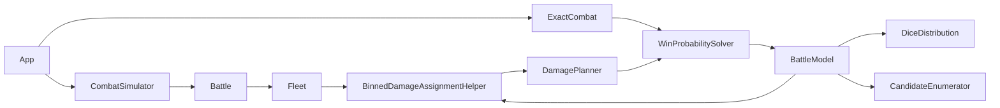

# Architecture

Luminary has two battle execution paths that share ship and damage-assignment rules:

- The simulation path samples dice and mutates live `Fleet` and `Ship` objects.
- The exact path enumerates dice outcomes and evaluates a graph of immutable HP states.

`Battle` is authoritative for user-visible combat semantics. When its schedule, terminal rules,
healing, or damage order changes, update the corresponding pure model behavior and contract
tests in the same change.



## Module Ownership

- `battle.ts`: authoritative mutable battle loop, phase order, healing boundaries, and terminal
  outcomes.
- `battle-rules.ts`: pure survival-to-terminal mapping shared by mutable and exact engines.
- `fleet.ts` and `ship.ts`: mutable combat entities, weapon rolls, planner lifetime, and battle
  reset behavior.
- `binned-damage-assignment-helper.ts`: routes NPC, DPS, initiative, and optimal assignments.
- `candidate-enumerator.ts`: legal distinct damage-assignment successors.
- `dice-distribution.ts`: exact probability distribution for a schedule slot.
- `battle-state.ts`: immutable exact-model schedule and one-slot state transitions. It does not
  solve graph values.
- `win-probability-solver.ts`: graph construction, minimax value iteration, and forward outcome
  propagation. It does not reproduce battle transitions.
- `optimal-damage-planner.ts`: adapts solved state values to the mutable planner interface and
  owns matchup-level solver caching.
- `exact-combat.ts`: converts fleets into an exact solve and maps its outcome back to the app's
  result shape.

## Solver Contract

Construct the solver with named options:

```ts
new WinProbabilitySolver(model, {
  perspective: 'A',
  assignments: 'minimax',
});
```

`perspective` controls whose win probability `solve()` reports. It does not control who gets
decision nodes.

`assignments` controls the policy model:

- `policy`: player fleets use deterministic DPS assignments and NPC fleets use NPC assignments.
- `minimax`: selected non-NPC assignments are decisions. By default both player fleets are
  selected; exact combat and the mutable optimal planner pass only the roles whose fleet damage
  type is `OPTIMAL`. Attacker nodes maximize and defender nodes minimize the queried reach
  objective.

The UI's `DamageType.OPTIMAL` selects minimax assignments. If an interactive solve exceeds its
caps, `OptimalDamagePlanner` falls back to DPS.

For diagnostics, `getGraphStats()` reports chance and decision ownership counts, while
`explainDecision(stateKey)` reports each dice outcome's candidate values and selected option.
These methods solve lazily and return read-only data; they do not alter the policy.

## Outcome Semantics

Terminal outcomes are `AttackerWins`, `DefenderWins`, and `Draw`. A draw is not a win for either
fleet. Non-terminating probability mass is credited to the defender, matching the mutable
engine's round-cap behavior.

For attacker perspective, the solver evaluates reachability of `AttackerWins`. For defender
perspective, it evaluates the complement of reaching `AttackerWins` or `Draw`; this preserves
both draw-as-loss and defender-favored nontermination.

## Exact Model Contract

The exact model must preserve these mutable-engine rules:

- The schedule contains all missile slots first, then cannon slots. Both groups use descending
  initiative with the defender first on ties. Missile slots run once; cannon slots cycle.
- A slot re-queries its fleet for living shooters. Minimum-shield filtering is therefore based
  on the currently living target ships and may change after a ship dies.
- Within a cannon slot, resolve weapon and rift rolls, assign rift self-damage with the NPC
  planner, assign target damage, then check the terminal outcome. This ordering permits a rift
  cannon to produce a draw. Missile slots can only destroy the target fleet.
- At cannon-cycle wrap-around, heal living ships before checking the no-living-cannons
  stalemate rule.

Exact working state is an HP vector for each original roster plus a schedule position. Roster
order is retained when materializing real ships for heuristic assignment. Canonical keys sort
HP only within groups of ships with the same `configKey`; this collapses interchangeable states
without changing first-seen planner behavior. Healing can increase HP, so the graph may contain
cycles and must not be treated as a DAG.

Policy transitions call the real `BinnedDamageAssignmentHelper` on materialized ship clones.
They do not reimplement NPC or DPS targeting. Minimax transitions reuse `enumerateCandidates`
to produce legal, distinct successor assignments; NPC assignment remains deterministic.

`dice-distribution.ts` groups ordinary die rolls by the set of living shield values they hit.
Identical dice are exchangeable, so it enumerates multinomial multisets rather than roll
sequences, then combines unlike groups by cartesian product. Rift dice use their five fixed
self/target-damage classes. Antimatter splitting applies to landed cannon shots, not missiles.

The unrestricted defaults cap a solve at 500,000 states, 20,000 outcomes per slot, and 10,000
value-iteration sweeps with convergence at `1e-10`. Unrestricted analysis has no wall-clock
limit. Interactive exact combat and optimal planning use a 2-second, 250,000-state budget; any
cap, timeout, or convergence failure falls back to DPS or Monte Carlo at the caller boundary.
The app also preflights two-fleet optimal battles by fleet variety: when both sides have three
or more ship types, it skips minimax and solves exact combat with DPS-policy assignments instead
of spending the timeout budget first. If one fleet has only one ship type, the opposing fleet
uses DPS-policy assignments and the ship-type cutoff is skipped for the remaining decision roles.

## Intentional Model Differences

The exact model does not reproduce two mutable-loop details:

- It models unbounded rounds and credits residual nontermination to the defender instead of
  stopping at the engine's finite round cap.
- It heals on exact schedule wrap-around. The mutable battle loop can shorten a round while
  iterating when phases disappear.

Keep these differences explicit. Do not add another approximation without documenting it here
and adding a focused test.

## Validation

Use the narrowest relevant command while iterating:

```bash
bun run test:solver
bun run test:engine
bun run typecheck
bun run lint
```

Before completing a cross-module engine change, run:

```bash
bun run check
```

Shared solver scenarios live in `scripts/matchups.ts`; they are tracked test fixtures, not
benchmark output.
